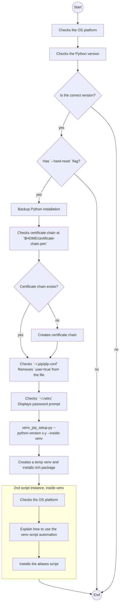

# Automate Virtual Environments using pip

A virtual environment (venv) is a self-contained directory that contains a Python installation for a particular version of **Python** and **pip**, plus a number of additional packages.

## Benefits of Using a Virtual Environment

- **Isolation**: Each project can have its own dependencies, regardless of what dependencies every other project has.
- **Control**: You can control which version of Python and which packages are used in your project.
- **Reproducibility**: Makes it easier to reproduce the environment on different machines.

## How to Create a Virtual Environment

You can create a virtual environment using the python `venv` package, as shown in the following command:

```shell
python -m venv venv
```

## How to Use the Virtual Environment

Once the virtual environment is created, you can activate it and install packages as needed.
When the virtual environment is activated, the prompt indicator on your terminal will change to show the name of the virtual environment, it will look like this: `(venv_name) $`.

**Activate the venv**:
    - On Windows: `\\path\\to\\venv\\Scripts\\activate`
    - On Unix or MacOS: `source /path/to/venv/bin/activate`

**Deactivate the venv**:
When you're done working in the venv, you can deactivate it by simply running:

```shell
(venv_name) $ deactivate
```

If you try to install packages without activating the venv, you will be awared with an ERROR message. Otherwise, if you install packages with the venv activated, they will be installed in the venv and not globally.
**Install Packages Outside the Virtual Environment**:

```shell
$ pip install <package_name>
ERROR: Could not install packages due to an EnvironmentError: Permission denied
```

You can install packages globally using the `--user` flag, but this is not recommended as it can lead to conflicts between package versions.

```shell
$ pip install --user <package_name>
```

**Install Packages In the Virtual Environment**:
Use pip to install packages within the activated venv:

```shell
(venv_name) $ pip install <package_name>
```

Remember to always activate your virtual environment before working on your project to ensure you're using the correct dependencies.


## How to

### How this scrip works



### How to run the setup automation

To run this setup automation to create virtual environments using pip run this command:

```bash
python3 venv_pip_setup.py
```

If you want to reset your main python installation packages, use this the `--hard-reset` flag:

```bash
python3 venv_pip_setup.py --hard-reset
```


### Post-installation instructions
Everything is ready! Now you need to add the following line to your shell configuration file (e.g., `~/.bashrc`, `~/.zshrc`, etc.) to load the aliases automatically when you start a new shell session:

```shell
source ${HOME}/.virtualenvs/bin/aliases.sh
```

**After adding the line, you can either restart your terminal or run the following command to apply the changes immediately:**

```shell
source ${HOME}/.bashrc  # or source ${HOME}/.zshrc
```

You can use TAB completion to autocomplete the venv-<command>, making it easier to use the commands.
For example, you can type `venv-` and then press the TAB key to see the available commands.

### How to use the `venv` commands

Those are the five command aliases that will be installed in the file `~/.virtualenvs/bin/aliases.sh`:

| Alias | Description |
| --- | --- |
| `$ venv-create <venv_name>` | Create a new virtual environment with the specified <venv_name>. |
| `$ venv <venv_name>` | Activate the virtual environment with the specified <venv_name>. |
| `$ venv-remove <venv_name>` | Deactivate and remove the virtual environment with the specified <venv_name>. |
| `$ venv-cd <venv_name>` | Change directory to the virtual environment directory with the specified <venv_name>. |
| `$ venv-ls` | List all available virtual environments. |

For example, to create a new virtual environment named `myenv`, you would run:

```shell
$ venv-create myenv
```

After the creation, the virtual environment can be activated. Your prompt will look like this:

```shell
(myenv) $
```

To install packages in the virtual environment, you can use pip as usual:

```shell
(myenv) $ pip install <package_name>  # to install just one package
(myenv) $ pip install -r requirements.txt  # to install packages from a requirements file
```

To deactivate the virtual environment, you can use the following command:

```shell
(myenv) $ deactivate
```

If you need to go back to the virtual environment, you can use the command:

```shell
$ venv myenv
```

To remove the virtual environment, you can use the command:

```shell
$ venv-remove myenv
```

